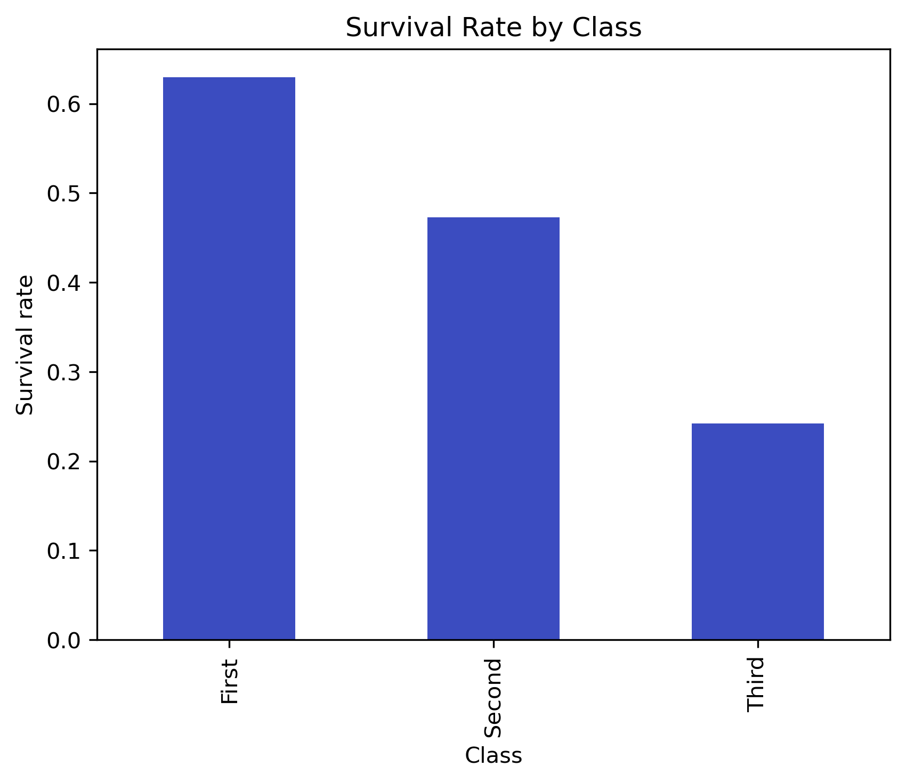
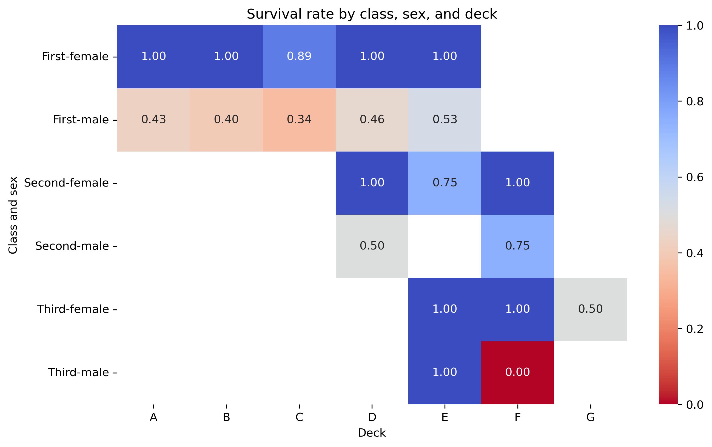

# Titanic SQL Analysis

This repository displays SQL analysis of the **partial Titanic manifest** dataset from the Python *seaborn* module.

## Table of Contents
1. [Overview](#overview)
2. [Setup and database creation](#setup)
3. [Queries](#queries)
4. [Insights](#insights)
5. [Folder structure](#folder_structure)

## Overview

This project explores survival rates on the Titanic based on several characteristics including **class, sex, age, and deck**.
It includes a **heatmap of the survival rate of passengers** for each instance of class, sex, and deck. In addition, a **ranking is devised** of surviving passengers of how likely their survival was given their demographic.
In each case, the relevant data is queried using SQL, then read using Python's *pandas* module and visualised using a mixture of *pandas* and *matplotlib*.
All analysis is done using SQLite for portability and reproducibility.

## Setup and database creation

First install the following Python dependencies:
```python
pip install pandas seaborn matplotlib sqlite3
```
Next these must be imported into the notebook:
```python
import pandas as pd
import seaborn as sns
import matplotlib.pyplot as plt
import sqlite3
```

And SQLite must be connected to:
```python
conn = sqlite3.connect("titanic.db")
cursor = conn.cursor()
```

The Titanic dataset exists within the *seaborn* module, so can be called upon immediately:
```python
df_raw = sns.load_dataset('Titanic')
```
The associated columns with this dataset must be renamed to work with the schema, the details of which can be copied from the full *.ipynb* file.

The dataset is normalised into the following tables:
- **passengers:** contains passenger details e.g. *sex*, *age*, *survived* (a Boolean value of 0 or 1), etc.
- **passenger_classes:** maps class IDs from the CSV file (1, 2, 3) to text names (First, Second, Third) for convenience
- **tickets:** contains fare and embarkment point information
- **cabins:** contains deck information

Here is a simple example, for clarity, of creating and populating one such table:
```sql
cursor.execute("""
CREATE TABLE IF NOT EXISTS passenger_classes (
    pclass_id INT PRIMARY KEY,
    class_name TEXT NOT NULL
)
""")
cursor.executemany(
    "INSERT INTO passenger_classes (pclass_id, class_name) VALUES (?, ?)",
    [(1, 'First'), (2, 'Second'), (3, 'Third')]
)
conn.commit()
```

## Queries

Here the common workflow of defining an SQL query as a text object in Python using *query="..."* (or *query="""//...//"""* for multi-line inputs) is used. These objects are then passed through the *pd.read_sql_query* function to immediately present the result of the query for use in Python.

The following queries are used:
- What is the survival rate of each **class** across the dataset?
- What is the class survival rate when subset by **sex**?
- What is the class and sex survival rate when subset by **deck**? (Presented as a heatmap; degrees of red for <50% survival and blue for >50%)
- Of those that survived, whom can be considered **least likely to have done so** given their demographic (age, sex, and class?)

The structure of these queries, with further comments, may be found in the full *.ipynb* file. For brevity a singular example is provided here (the final query):
```python
query = """
WITH base AS (
    SELECT
        p.passenger_id,
        pc.class_name,
        p.sex,
        p.age,
        p.survived,

        CASE 
            WHEN age IS NULL THEN 'unknown'
            WHEN age < 12 THEN 'child'
            WHEN age < 30 THEN 'young'
            WHEN age < 55 THEN 'adult'
            ELSE 'senior'
        END AS age_group,
        
        AVG(p.survived) OVER (PARTITION BY pc.class_name) AS class_survival_rate,
        AVG(p.survived) OVER (PARTITION BY p.sex) AS sex_survival_rate,
        AVG(p.survived) OVER (
            PARTITION BY CASE 
                WHEN age IS NULL THEN 'unknown'
                WHEN age < 12 THEN 'child'
                WHEN age < 30 THEN 'young'
                WHEN age < 55 THEN 'adult'
                ELSE 'senior'
            END
        ) AS age_survival_rate,

        AVG(p.survived) OVER () AS overall_survival_rate
    FROM passengers p
    JOIN passenger_classes pc
        ON p.pclass_id = pc.pclass_id
    WHERE p.age IS NOT NULL
),

scores AS (
    SELECT
        passenger_id,
        class_name,
        sex,
        age,
        age_group,
        survived,
        class_survival_rate,
        sex_survival_rate,
        age_survival_rate,
        overall_survival_rate,

        (survived - class_survival_rate) + (survived - sex_survival_rate) + (survived - age_survival_rate) AS survival_advantage,

        RANK() OVER (ORDER BY 
                    (survived - class_survival_rate)
                    + (survived - sex_survival_rate)
                    + (survived - age_survival_rate) DESC
                    ) AS advantage_rank
    FROM base
)

SELECT *
FROM scores
WHERE advantage_rank <= 10
ORDER BY advantage_rank;
"""

df_query = pd.read_sql_query(query, conn)
df_query*
```

In this example, the query sets a CTE base with the specified characteristics, calculates a class, sex, and (binned) age survival rate, then from these calculates a **survival advantage** for each passenger. From this a **ranked order** of all passengers in the manifest is formed and the top 10 are produced.

## Insights

Firstly the survival rate of passengers by class:

It is well-established that there was a correlation between class and chance of survival, as more affluent passengers were prioritised. Thus, this can be considered more of a trial query.

Secondly, the survival rate of passengers in each class according to their sex:

It is also well-established, and often used with reference to contemporary culture, that women survived in greater rates than men due to the societal norm and pressure to prioritise women and children ahead of adult men. This does however show the disparity of this between the classes; even Third Class female passengers had a higher survival rate (in this partial dataset) than First Class male passengers.

Next, the survival rate of each class and sex combination for each deck:

Here degrees of increasing reddishness represent chances of survival below 50%, and the reverse for increasingly blue hues. The incomplete nature of the dataset (containing 891 entries as opposed to the roughly 2200 actual passengers) has the effect of leaving some of these blocks empty.

Finally, the ranking of passengers by how likely they might be expected to survive given their sex, class, and age:
```
|   passenger_id | class_name   | sex   |   age | age_group   |   survived |   class_survival_rate |   sex_survival_rate |   age_survival_rate |   overall_survival_rate |   survival_advantage |   advantage_rank |
|---------------:|:-------------|:------|------:|:------------|-----------:|----------------------:|--------------------:|--------------------:|------------------------:|---------------------:|-----------------:|
|             82 | Third        | male  |    29 | young       |          1 |              0.239437 |            0.205298 |            0.370253 |                0.406162 |              2.18501 |                1 |
|            126 | Third        | male  |    12 | young       |          1 |              0.239437 |            0.205298 |            0.370253 |                0.406162 |              2.18501 |                1 |
|            128 | Third        | male  |    24 | young       |          1 |              0.239437 |            0.205298 |            0.370253 |                0.406162 |              2.18501 |                1 |
|            147 | Third        | male  |    27 | young       |          1 |              0.239437 |            0.205298 |            0.370253 |                0.406162 |              2.18501 |                1 |
|            205 | Third        | male  |    18 | young       |          1 |              0.239437 |            0.205298 |            0.370253 |                0.406162 |              2.18501 |                1 |
|            208 | Third        | male  |    26 | young       |          1 |              0.239437 |            0.205298 |            0.370253 |                0.406162 |              2.18501 |                1 |
|            221 | Third        | male  |    16 | young       |          1 |              0.239437 |            0.205298 |            0.370253 |                0.406162 |              2.18501 |                1 |
|            268 | Third        | male  |    25 | young       |          1 |              0.239437 |            0.205298 |            0.370253 |                0.406162 |              2.18501 |                1 |
|            272 | Third        | male  |    25 | young       |          1 |              0.239437 |            0.205298 |            0.370253 |                0.406162 |              2.18501 |                1 |
|            284 | Third        | male  |    19 | young       |          1 |              0.239437 |            0.205298 |            0.370253 |                0.406162 |              2.18501 |                1 |
|            392 | Third        | male  |    21 | young       |          1 |              0.239437 |            0.205298 |            0.370253 |                0.406162 |              2.18501 |                1 |
```

This is calculated by comparing their survival (a value of 1) compared to the expected survival rate of each of these chosen characteristics (a decimal between 0 and 1), then combining all of these into a survival advantage coefficient (bound between 0 and 3 for surviving passengers). Ranking these scores we see that the top 10 are entirely Third Class male passengers in the young age category (here defined as 12 to 30 years of age), which is congruent with what we have understood previously about the effect of class and sex on survival rates.
However, we might expect that age would have a negative effect on survival rates e.g. reduced ability to reach lifeboats and resistance to cold temperatures or shock. By running a further diagnostic query specifically for those in the old age category (55+ years old) while holding the other characteristics constant (Third Class; male), we find that of the five recorded in this partial dataset, none survived:
```
|   passenger_id | class_name   | sex   |   age | age_group   |   survived |   class_survival_rate |   sex_survival_rate |   age_survival_rate |   overall_survival_rate |   survival_advantage |
|---------------:|:-------------|:------|------:|:------------|-----------:|----------------------:|--------------------:|--------------------:|------------------------:|---------------------:|
|             95 | Third        | male  |  59   | senior      |          0 |              0.239437 |            0.205298 |            0.309524 |                0.406162 |            -0.754258 |
|            117 | Third        | male  |  70.5 | senior      |          0 |              0.239437 |            0.205298 |            0.309524 |                0.406162 |            -0.754258 |
|            153 | Third        | male  |  55.5 | senior      |          0 |              0.239437 |            0.205298 |            0.309524 |                0.406162 |            -0.754258 |
|            281 | Third        | male  |  65   | senior      |          0 |              0.239437 |            0.205298 |            0.309524 |                0.406162 |            -0.754258 |
|            327 | Third        | male  |  61   | senior      |          0 |              0.239437 |            0.205298 |            0.309524 |                0.406162 |            -0.754258 |
|            852 | Third        | male  |  74   | senior      |          0 |              0.239437 |            0.205298 |            0.309524 |                0.406162 |            -0.754258 |
```

There is scope for many further insights; for example analysis of family size (calculated as *no. of siblings/spouses + no. of parents/children +1*) as a factor in survival ratios. Other information stored in this dataset includes fares paid, which was foregone in favour of designated class; departure location, which again was considered to be a weakly correlated characteristic with class and deck (e.g. if passengers embark at Cherbourg instead of Southampton, they may be more likely to be First Class due to the relative affluence of the locations, or may be more likely to be placed in a given deck if others were filled up at the first location). Given the relatively small size of the dataset, this was not considered a reliable avenue, but indeed this is yet to be confirmed and I will look to this in future when extending the project.

Here, the primary aim was to display the ability to initialise an SQLite database and correctly populate it from a CSV file, and to write sophisticated queries that take advantage of the relational nature of the database.

## Folder structure

TitanicSQL/
│
├── queries.ipynb       # Jupyter Notebook containing SQL queries, visualizations, and analysis
├── titanic.db          # SQLite database created from the Titanic dataset
├── README.md           # This file